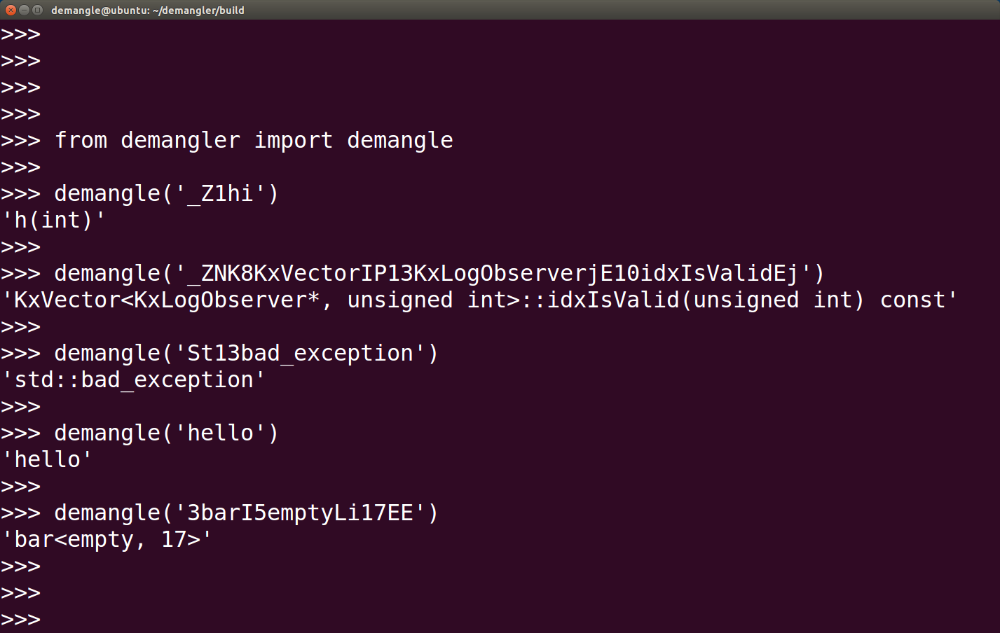

Demangler [](https://travis-ci.org/P4N74/demangler)
=========

> Demangle even the most complex gcc mangled names, with absolute ease

*Demangler* is a module written in Python that can be used to demangle identifiers that were mangled by GCC 3.x and above.



Usage
-----

```
from demangler import demangle
print demangle(<mangled_name>)
```

Setup
-----

```
sudo pip install demangler
```
or, if you are feeling particularly adventurous
```
git clone https://github.com/P4N74/demangler.git
cd demangler
sudo apt-get install g++ python-dev python3-dev
python setup.py install
python3 setup.py install
```

Boring stuff
------------

This project is licensed under the [MIT License](http://jenish.mit-license.org/).
